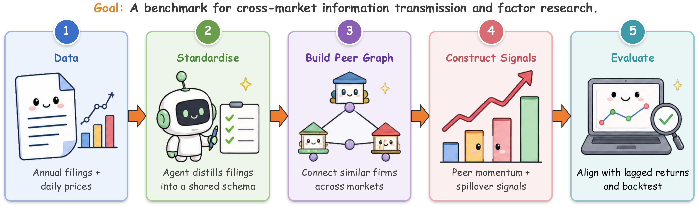

# CrossAlpha: An Annual-Report Benchmark for Cross-Market Factor Research

**Official code and data for the CrossAlpha benchmark.**

This repository contains the official implementation of **CrossAlpha**, a public
annual-report benchmark for cross-market factor research. It standardizes annual reports
from five equity markets into a fixed ten-category business schema, builds a dense directed
cross-market peer-similarity graph from the resulting firm-level text embeddings, and aligns
that graph with daily price data — then ships fixed evaluation entry points and reference
results so cross-market peer-momentum factors can be compared under a common protocol. It
is the anonymized supplement for a double-blind submission.

<p align="center">
  
</p>

| | |
|---|---|
| Markets | US (Russell 1000), Japan (TOPIX 500), Taiwan (TWSE), South Korea (KOSPI), Hong Kong (main board) |
| Coverage | ~3,587 firms, ~10,700 firm-years |
| Price panel | 11 years of daily OHLCV (January 2015 – May 2026) |
| Similarity graph | ~19M directed cross-market firm-pair scores from PCA-whitened embeddings |

## Installation

Use Python 3.11 or newer.

```bash
pip install -r requirements.txt
```

The scripts read the project and data roots from environment variables, so no
user-specific absolute paths are hard-coded:

```bash
export CROSSALPHA_PROJECT_ROOT=/path/to/this/repo
export CROSSALPHA_DATA_ROOT=/path/to/crossalpha-data
```

Stages that call hosted LLM APIs read `OPENAI_API_KEY` / `ANTHROPIC_API_KEY` from the
environment; no keys are stored in the repo.

## Project Structure

```text
crossalpha/
├── requirements.txt
├── scripts/
│   │  # — construction pipeline (stages 1–5) —
│   ├── parse_10k.py                         # 1. US filings → ten-category schema (LLM)
│   ├── parse_reports_claude.py              # 1. all-market parser → ten-category schema
│   ├── generate_embeddings.py               # 2. category text → 3072-d embeddings
│   ├── whiten_embeddings.py                 # 3. PCA whitening → shared 128-d basis
│   ├── cache_similarity.py                  # 4. cosine → percentile-rank similarity graph
│   ├── run_graph_monthly.py                 # 5. cross-market peer-momentum factor
│   ├── run_us_ema_mr_to_jp_mvp.py           # 5. US→JP factor variant
│   ├── run_agentic_eval.py                  # agent-weighted graph evaluation
│   ├── agentic_eval_helpers.py              # agent eval helpers
│   ├── agentic_retrieval_tools.py           # vector-search retrieval tool
│   │  # — evaluation entry points —
│   ├── run_baselines_monthly.py             # US→JP peer-definition comparison
│   ├── run_paper_multi_market_monthly.py    # raw US→target generalization
│   ├── run_cross_vs_same_market_matrix.py   # 5×5 cross- vs same-market matrix
│   ├── run_pooled_similarity_mild.py        # best-single vs pooled sources
│   ├── run_category_ablation_multi_target.py# ten-category schema ablation
│   ├── run_rq3_mild_rerun.py                # event-driven daily evaluation
│   ├── similarity_cache.py                  # similarity-matrix cache helper
│   ├── kernels/                             # similarity, neutralization, ranking, returns
│   ├── backtesting/                         # portfolio-sort engines, metrics, reports
│   └── h5_data/                             # HDF5 panel loaders
├── ar_scraper/                          # annual-report scraper toolkit (5 markets)
└── supplement/
    ├── results/                         # JSON outputs behind the paper tables/figures
    ├── metadata/                        # SymbolDict.csv, DataDict.csv
    ├── standardized_reports/            # ten-category JSON text, all 5 markets (FY2022–2024)
    │   ├── 10_k_filings/                #   US  FY2024 (767)
    │   ├── 10_k_filings_fy2022/         #   US  FY2022 vintage (863)
    │   ├── 10_k_filings_fy2023/         #   US  FY2023 vintage (671)
    │   ├── securities_reports/          #   JP  (1,372)
    │   ├── securities_reports_tw/       #   TW  (1,040)
    │   ├── securities_reports_kr/       #   KR  (612)
    │   └── securities_reports_hk/       #   HK  (572)
    └── DATA_MANIFEST.md                 # full-release layout
```

## Data Preparation

The construction pipeline runs in order; each stage produces an artifact consumed by the
next. Stages 1–4 need the raw corpus and LLM API keys (released after review).

```bash
python scripts/parse_10k.py                   # 1. filings → ten-category schema (LLM)
python scripts/generate_embeddings.py         # 2. category text → 3072-d embeddings
python scripts/whiten_embeddings.py           # 3. PCA whitening → shared 128-d basis
python scripts/cache_similarity.py            # 4. cosine → percentile-rank similarity graph
```

Raw filings are collected with the `ar_scraper/` toolkit (one scraper per market). The
exact LLM `SYSTEM_PROMPT` used for schema extraction lives in `parse_10k.py` and
`parse_reports_claude.py`.

## Building the Factor

The cross-market factor aggregates the sector-relative returns of source-market peers,
weighted by a sigmoid-transformed text-similarity rank (top-1% per row). For a target
stock *i* in market *a* and a source market *b*:

```
f_i(t) = sum_j ( alpha_ij * r_j(t) ) / sum_j ( alpha_ij ),   j in source market b
```

where `r_j(t)` is peer *j*'s L-month sector-relative cumulative return and `alpha_ij` is
the similarity weight. Build it from the cached similarity graph:

```bash
python scripts/run_graph_monthly.py           # cross-market peer-momentum factor
python scripts/run_us_ema_mr_to_jp_mvp.py     # US→JP factor variant
```

## Evaluation

The benchmark is organized around three research questions, mirroring the paper. Each
entry point runs off the cached similarity graph and the shipped results; override the
lookback or source/target arguments via `argparse` flags.

```bash
# RQ1 — do cross-market text peers beat single-market and non-text peers?
# US→JP peer-definition comparison (text vs GICS / return-corr / domestic)
python scripts/run_baselines_monthly.py --lookback 12

# RQ2 — where should source peers come from? (directed information geography)
# raw US→target generalization across the four Asian targets
python scripts/run_paper_multi_market_monthly.py
# 5×5 cross- vs same-market matrix (per-source-target factor)
python scripts/run_cross_vs_same_market_matrix.py
# best single source vs pooled sources per target
python scripts/run_pooled_similarity_mild.py
# ten-category business-schema ablation
python scripts/run_category_ablation_multi_target.py

# RQ3 — does the same graph support event-conditioned daily spillover prediction?
# event-conditioned daily basket evaluation (with optional GPT-5 agent filter)
python scripts/run_rq3_mild_rerun.py
```

The JSON files under `supplement/results/` are the exact outputs behind the reported
numbers, so the tables and figures can be inspected without re-running anything.

## Construction Stages

| # | Stage | Script | Output |
|---|-------|--------|--------|
| 1 | Schema extraction | `parse_10k.py`, `parse_reports_claude.py` | per-firm JSON under a fixed ten-category business schema, distilled by an LLM |
| 2 | Embedding | `generate_embeddings.py` | a 3072-d `text-embedding-3-large` vector per category per firm |
| 3 | PCA whitening | `whiten_embeddings.py` | a shared 128-d whitened basis (`Cov(Z)=I`) fit jointly across all markets |
| 4 | Similarity graph | `cache_similarity.py` | weighted cross-category cosine similarity → per-row percentile-rank matrices |
| 5 | Factor | `run_graph_monthly.py` | the monthly cross-market peer-momentum factor |

## License

This dataset and code are released under the MIT License.


